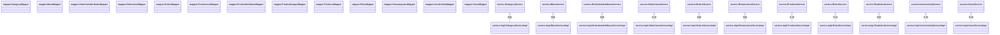

```mermaid
classDiagram
    class mapper.CategoryMapper
    class mapper.MenuMapper
    class mapper.OrderitemAttributesMapper
    class mapper.OrderitemsMapper
    class mapper.OrdersMapper
    class mapper.PermissionsMapper
    class mapper.ProductAttributesMapper
    class mapper.ProductImagesMapper
    class mapper.ProductsMapper
    class mapper.RolesMapper
    class mapper.SubcategoriesMapper
    class mapper.UserActivityMapper
    class mapper.UsersMapper

    class service.ICategoryService
    class service.IMenuService
    class service.IOrderitemAttributesService
    class service.IOrderitemsService
    class service.IOrdersService
    class service.IPermissionsService
    class service.IProductsService
    class service.IRolesService
    class service.IStatisticsService
    class service.IUserActivityService
    class service.IUsersService

    class service.impl.CategoryServiceImpl
    class service.impl.MenuServiceImpl
    class service.impl.OrderitemAttributesServiceImpl
    class service.impl.OrderitemsServiceImpl
    class service.impl.OrdersServiceImpl
    class service.impl.PermissionsServiceImpl
    class service.impl.ProductsServiceImpl
    class service.impl.RolesServiceImpl
    class service.impl.StatisticsServiceImpl
    class service.impl.UserActivityServiceImpl
    class service.impl.UsersServiceImpl

    service.ICategoryService <|-- service.impl.CategoryServiceImpl : 实现
    service.IMenuService <|-- service.impl.MenuServiceImpl : 实现
    service.IOrderitemAttributesService <|-- service.impl.OrderitemAttributesServiceImpl : 实现
    service.IOrderitemsService <|-- service.impl.OrderitemsServiceImpl : 实现
    service.IOrdersService <|-- service.impl.OrdersServiceImpl : 实现
    service.IPermissionsService <|-- service.impl.PermissionsServiceImpl : 实现
    service.IProductsService <|-- service.impl.ProductsServiceImpl : 实现
    service.IRolesService <|-- service.impl.RolesServiceImpl : 实现
    service.IStatisticsService <|-- service.impl.StatisticsServiceImpl : 实现
    service.IUserActivityService <|-- service.impl.UserActivityServiceImpl : 实现
    service.IUsersService <|-- service.impl.UsersServiceImpl : 实现
```